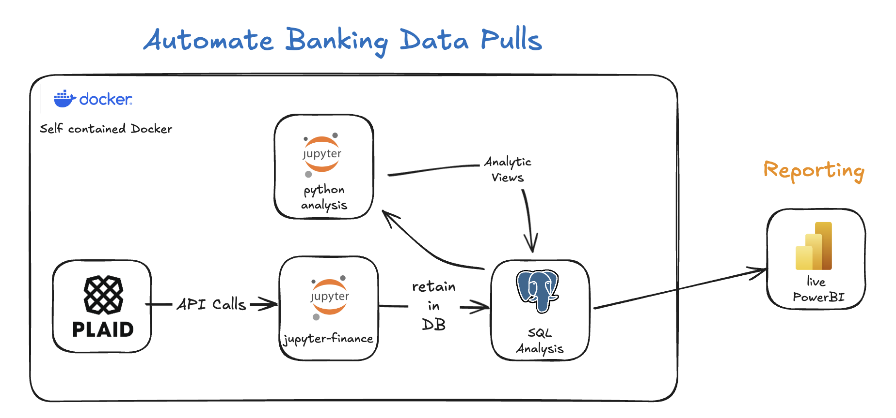

# Jupyter Finance


<!-- WARNING: THIS FILE WAS AUTOGENERATED! DO NOT EDIT! -->

[](https://github.com/billthan/jupyter-finance/actions/workflows/test.yaml)
[](https://github.com/billthan/jupyter-finance/actions/workflows/deploy.yaml)

A Docker based solution leveraging Plaid API data to automate and store
personal financial data in PostgreSQL for analysis in Jupyter Notebooks.

Development is facilitated through the use of notebook development
framework: [nbdev](https://nbdev.fast.ai/)



## Risks

This product is in a pre-release stage.

## Developer Guide

### Prerequisites

- [Docker](https://docs.docker.com/get-docker/)
- [act](https://github.com/nektos/act#installation)
- [nbdev](https://nbdev.fast.ai/)

### Setup environmental variables

Set up all your variables in `.env.example` first

``` sh
$ cp .env.example .env
```

### Install jupyter_finance in Development mode

``` sh
# make sure jupyter_finance package is installed in development mode
$ pip install -e .

# make changes under nbs/ directory
# ...

# compile to have changes apply to jupyter_finance
$ nbdev_prepare
```

### Building jupyter_finance in Development mode

``` sh
$ ./build-dist.sh
# ensure prior instances of docker volumes are removed
$ docker-compose up --build
```

### Running Github actions locally to test

``` bash
$ act
```

### Documentation

Documentation can be found hosted on this GitHub
[repository](https://github.com/billthan/jupyter-finance)’s [API
pages](https://billthan.github.io/jupyter-finance/).
